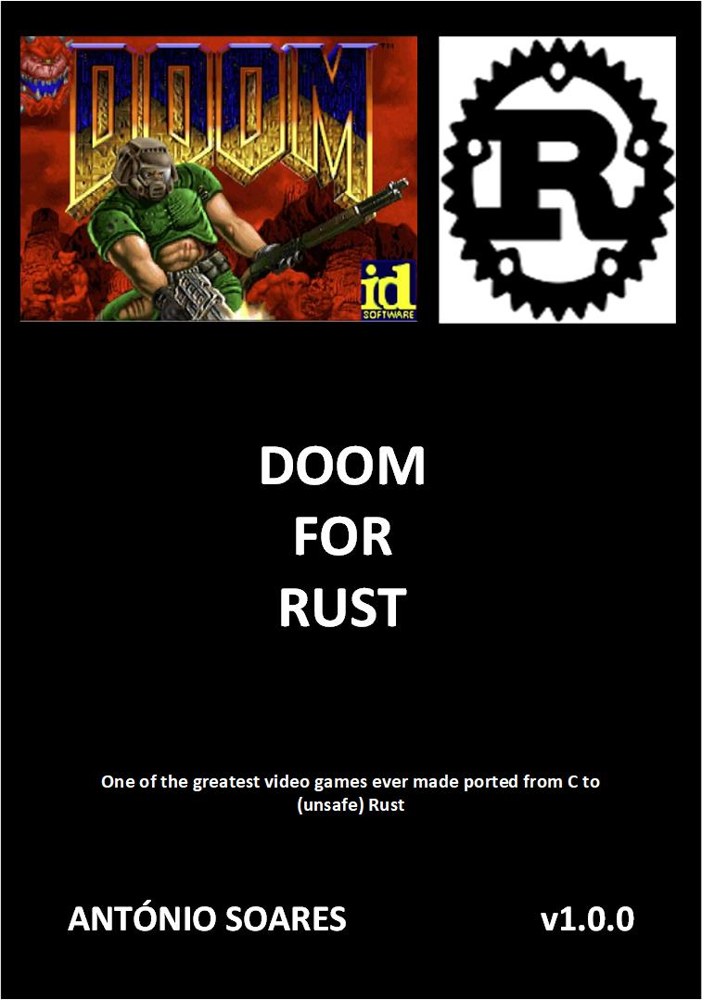

# Doom4Rust v0.1.0

## Description

At this stage, only the initial splash screen is working but the complete project structure is created.
This is Unsafe Rust, it seems too much complicated and time consuming to convert to Safe Rust.



This port is based on sdl2-doom by AlexOberhofer:

* [sdl2-doom](https://github.com/AlexOberhofer/sdl2-doom)

Original Doom by id Software:

* [DOOM](https://github.com/id-Software/DOOM)

This book helps understanding many of the internals of the original game:

* [Game Engine Black Book: DOOM](https://fabiensanglard.net/gebbdoom/)

## Dependencies

* [Rust-SDL2](https://github.com/Rust-SDL2/rust-sdl2)

## Build and run

### Install SDL2/SDL2-Mixer:

#### Ubuntu

sudo apt install libsdl2-2.0-0

sudo apt install libsdl2-dev

sudo apt install libsdl2-mixer-2.0-0

sudo apt install libsdl2-mixer-dev

#### CentOS

sudo dnf --enablerepo=powertools install SDL2

sudo dnf --enablerepo=powertools install SDL2-devel

sudo dnf --enablerepo=powertools install SDL2_mixer

sudo dnf --enablerepo=powertools install SDL2_mixer-devel

#### macOS

brew install sdl2

brew install sdl2_mixer

```
cargo build --release

cargo run --release

```

## Author

* [Antonio Soares](https://github.com/ccie18473)

## License

This project is licensed under the [MIT] License - see the LICENSE.md file for details

The DOOM textures are copyrighted by id Software.